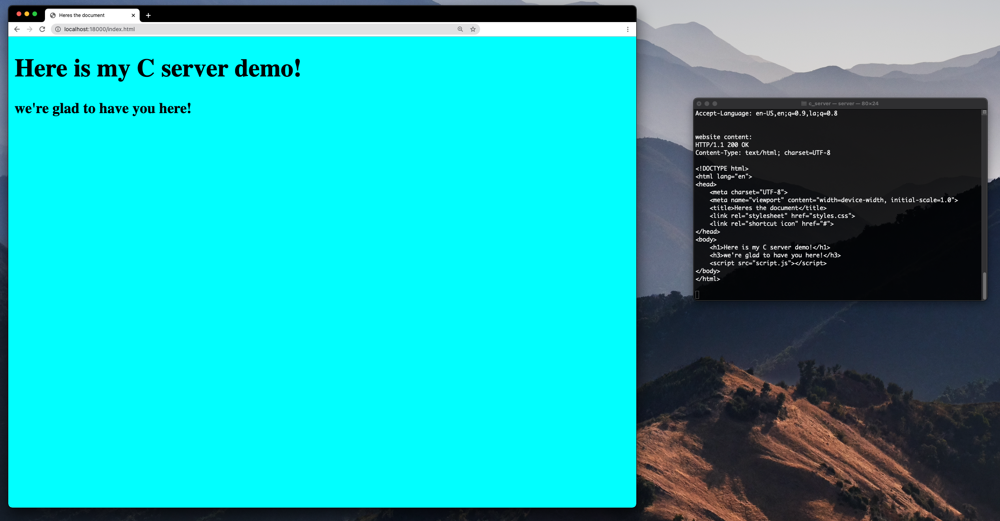

# C-server
Multi-Threaded C server that can accept Javascript, HTML, and CSS files

Project Summary: For this project I used open source code from https://beej.us/guide/bgnet/examples/server.c, which provides C code for a server that sends "Hello
world" into a stream socket. I updated this code to be able to display HTML, CSS, and Javascript files on a web browser. 

Tools used: C, make
